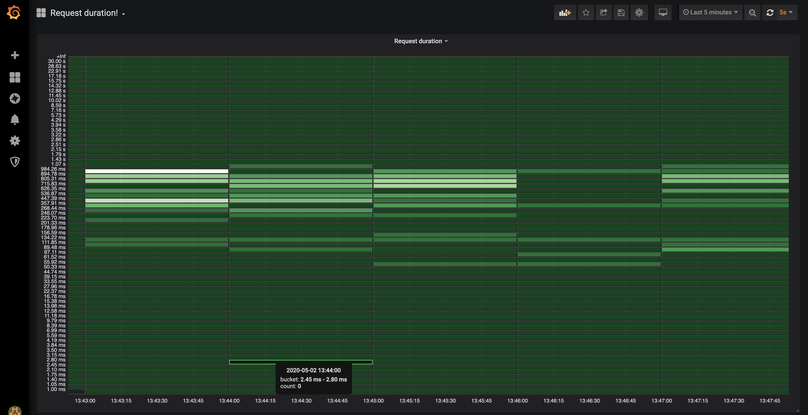

# Proof of concept Spring Boot application with micrometer, MongoDB and Prometheus monitoring

Run MongoDB, Application, Prometheus and Grafana:

```shell script
docker-compose up -d
```
Prometheus
http://localhost:9090

Grafana http://localhost:3000
admin/admin
#
To rebuild spring application image run
```shell script
./gradlew bootBuildImage
```
and change `docker-compose.yml`

```yaml
services:
  spring:
    image: docker.io/library/spring-prometheus:0.0.1-SNAPSHOT
```


## @Timed annotation
Using [@Timed annotation](https://micrometer.io/docs/concepts#_the_timed_annotation) it is possible to observe
 the latency distribution of method invocations.
I have annotated method `getAllBooks()` in `BookService` and made artificial delay for each request.
The parameter `histogram = true' makes additional metrics for building a histogram of request duration.  
```java
    @Timed(value = "book_get_all", histogram = true)
    public List<Book> getAllBooks() {
        randomDelay();
        return repository.findAll();
    }
```

Execute several times
```shell script
curl localhost:8080/books
```
and you could see a bunch of new metrics there `http://localhost:8080/actuator/prometheus`

```text
...
book_get_all_seconds_bucket{application="demoservice",class="com.bodyakin.springprometheus.services.BookService",exception="none",method="getAllBooks",le="0.156587348",} 0.0
book_get_all_seconds_bucket{application="demoservice",class="com.bodyakin.springprometheus.services.BookService",exception="none",method="getAllBooks",le="0.178956969",} 0.0
book_get_all_seconds_bucket{application="demoservice",class="com.bodyakin.springprometheus.services.BookService",exception="none",method="getAllBooks",le="0.20132659",} 0.0
book_get_all_seconds_bucket{application="demoservice",class="com.bodyakin.springprometheus.services.BookService",exception="none",method="getAllBooks",le="0.223696211",} 0.0
book_get_all_seconds_bucket{application="demoservice",class="com.bodyakin.springprometheus.services.BookService",exception="none",method="getAllBooks",le="0.246065832",} 0.0
book_get_all_seconds_bucket{application="demoservice",class="com.bodyakin.springprometheus.services.BookService",exception="none",method="getAllBooks",le="0.268435456",} 0.0
book_get_all_seconds_bucket{application="demoservice",class="com.bodyakin.springprometheus.services.BookService",exception="none",method="getAllBooks",le="0.357913941",} 0.0
book_get_all_seconds_bucket{application="demoservice",class="com.bodyakin.springprometheus.services.BookService",exception="none",method="getAllBooks",le="0.447392426",} 2.0
book_get_all_seconds_bucket{application="demoservice",class="com.bodyakin.springprometheus.services.BookService",exception="none",method="getAllBooks",le="0.536870911",} 2.0
book_get_all_seconds_bucket{application="demoservice",class="com.bodyakin.springprometheus.services.BookService",exception="none",method="getAllBooks",le="0.626349396",} 4.0
book_get_all_seconds_bucket{application="demoservice",class="com.bodyakin.springprometheus.services.BookService",exception="none",method="getAllBooks",le="0.715827881",} 4.0
book_get_all_seconds_bucket{application="demoservice",class="com.bodyakin.springprometheus.services.BookService",exception="none",method="getAllBooks",le="0.805306366",} 6.0
book_get_all_seconds_bucket{application="demoservice",class="com.bodyakin.springprometheus.services.BookService",exception="none",method="getAllBooks",le="0.894784851",} 6.0
book_get_all_seconds_bucket{application="demoservice",class="com.bodyakin.springprometheus.services.BookService",exception="none",method="getAllBooks",le="0.984263336",} 6.0
book_get_all_seconds_bucket{application="demoservice",class="com.bodyakin.springprometheus.services.BookService",exception="none",method="getAllBooks",le="1.073741824",} 7.0
book_get_all_seconds_bucket{application="demoservice",class="com.bodyakin.springprometheus.services.BookService",exception="none",method="getAllBooks",le="1.431655765",} 7.0
book_get_all_seconds_bucket{application="demoservice",class="com.bodyakin.springprometheus.services.BookService",exception="none",method="getAllBooks",le="1.789569706",} 7.0
book_get_all_seconds_bucket{application="demoservice",class="com.bodyakin.springprometheus.services.BookService",exception="none",method="getAllBooks",le="2.147483647",} 7.0
book_get_all_seconds_bucket{application="demoservice",class="com.bodyakin.springprometheus.services.BookService",exception="none",method="getAllBooks",le="2.505397588",} 7.0
book_get_all_seconds_bucket{application="demoservice",class="com.bodyakin.springprometheus.services.BookService",exception="none",method="getAllBooks",le="2.863311529",} 7.0
book_get_all_seconds_bucket{application="demoservice",class="com.bodyakin.springprometheus.services.BookService",exception="none",method="getAllBooks",le="3.22122547",} 7.0
book_get_all_seconds_bucket{application="demoservice",class="com.bodyakin.springprometheus.services.BookService",exception="none",method="getAllBooks",le="3.579139411",} 7.0
book_get_all_seconds_bucket{application="demoservice",class="com.bodyakin.springprometheus.services.BookService",exception="none",method="getAllBooks",le="3.937053352",} 7.0
book_get_all_seconds_bucket{application="demoservice",class="com.bodyakin.springprometheus.services.BookService",exception="none",method="getAllBooks",le="4.294967296",} 7.0
book_get_all_seconds_bucket{application="demoservice",class="com.bodyakin.springprometheus.services.BookService",exception="none",method="getAllBooks",le="5.726623061",} 7.0
book_get_all_seconds_bucket{application="demoservice",class="com.bodyakin.springprometheus.services.BookService",exception="none",method="getAllBooks",le="7.158278826",} 7.0
book_get_all_seconds_bucket{application="demoservice",class="com.bodyakin.springprometheus.services.BookService",exception="none",method="getAllBooks",le="8.589934591",} 7.0
book_get_all_seconds_bucket{application="demoservice",class="com.bodyakin.springprometheus.services.BookService",exception="none",method="getAllBooks",le="10.021590356",} 7.0
book_get_all_seconds_bucket{application="demoservice",class="com.bodyakin.springprometheus.services.BookService",exception="none",method="getAllBooks",le="11.453246121",} 7.0
book_get_all_seconds_bucket{application="demoservice",class="com.bodyakin.springprometheus.services.BookService",exception="none",method="getAllBooks",le="12.884901886",} 7.0
book_get_all_seconds_bucket{application="demoservice",class="com.bodyakin.springprometheus.services.BookService",exception="none",method="getAllBooks",le="14.316557651",} 7.0
book_get_all_seconds_bucket{application="demoservice",class="com.bodyakin.springprometheus.services.BookService",exception="none",method="getAllBooks",le="15.748213416",} 7.0
book_get_all_seconds_bucket{application="demoservice",class="com.bodyakin.springprometheus.services.BookService",exception="none",method="getAllBooks",le="17.179869184",} 7.0
book_get_all_seconds_bucket{application="demoservice",class="com.bodyakin.springprometheus.services.BookService",exception="none",method="getAllBooks",le="22.906492245",} 7.0
book_get_all_seconds_bucket{application="demoservice",class="com.bodyakin.springprometheus.services.BookService",exception="none",method="getAllBooks",le="28.633115306",} 7.0
book_get_all_seconds_bucket{application="demoservice",class="com.bodyakin.springprometheus.services.BookService",exception="none",method="getAllBooks",le="30.0",} 7.0
book_get_all_seconds_bucket{application="demoservice",class="com.bodyakin.springprometheus.services.BookService",exception="none",method="getAllBooks",le="+Inf",} 7.0
book_get_all_seconds_count{application="demoservice",class="com.bodyakin.springprometheus.services.BookService",exception="none",method="getAllBooks",} 7.0
book_get_all_seconds_sum{application="demoservice",class="com.bodyakin.springprometheus.services.BookService",exception="none",method="getAllBooks",} 4.627468766

```

You can see this metrics visualisation in `Request duration` Grafana dashboard 

